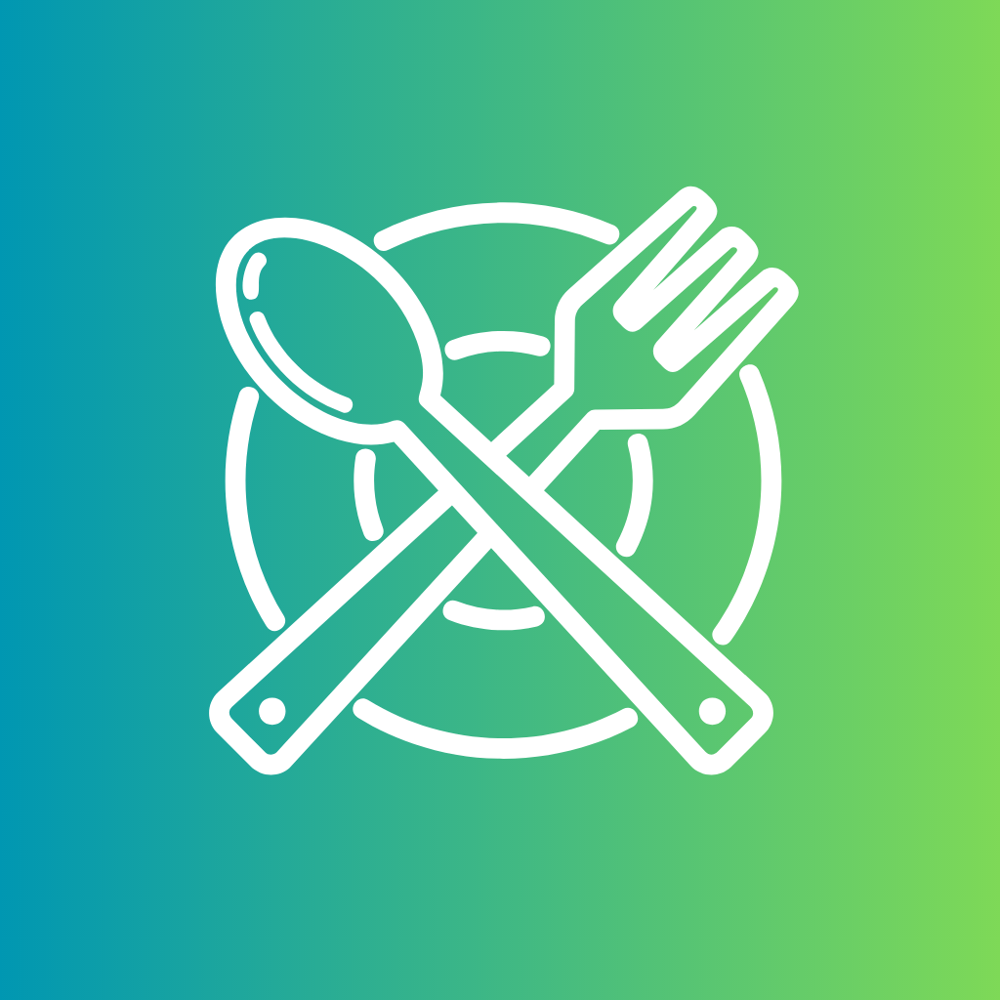
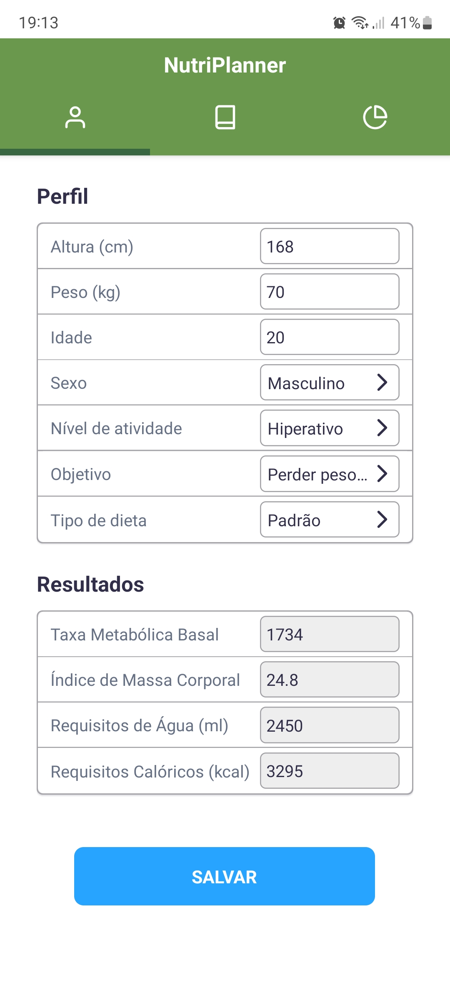
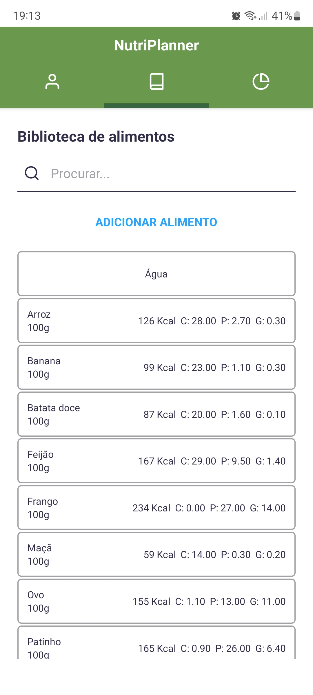
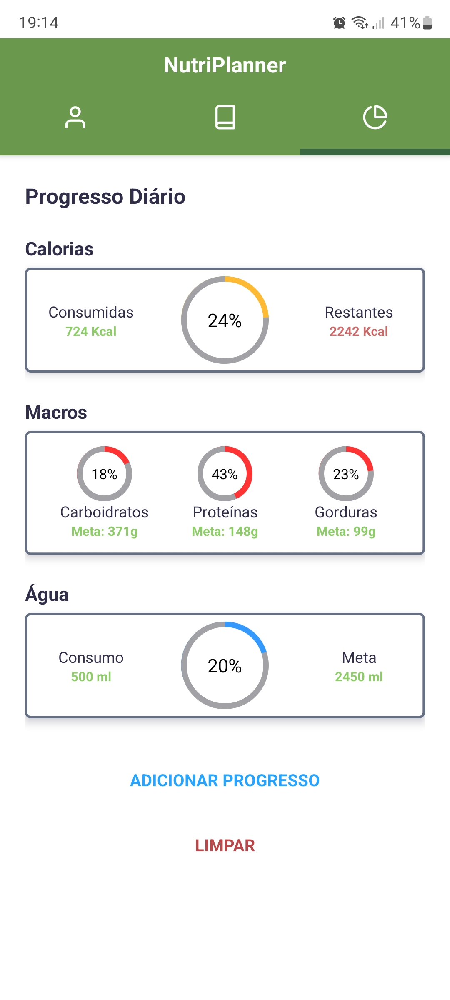

<h1 align="center">NutriPlanner</h1>
<div align="center">
  
  <h3 align="center">Seus macros sob controle</h3>
  <p align="center">
  </p>
    <div>
    
    
    
  </div>
</div>

  <h1><summary>Sumário</summary></h1>
  <ol>
    <li><a href="#sobre-o-projeto">Sobre o Projeto</a></li>
    <li><a href="#feito-com">Feito com</a></li>
    <li><a href="#desenvolvedor">Desenvolvedor</a></li>
    <li><a href="#licenca">Licença</a></li>
    <li><a href="#contato">Contato</a></li>
  </ol>


<div id="sobre-o-projeto"> </div>

## 📝 Sobre o projeto

NutriPlanner é um aplicativo mobile (android) cujo objetivo é auxiliar em dietas. Para isso, conta com a dinâmica de metas diárias de macronutrientes a serem consumidos. As metas são estabelecidas dadas as métricas biológicas fornecidas pelo usuário. No sistema, o usuário cria uma biblioteca própria com alimentos e receitas, especificando seus macronutrientes e, através deles, registra sua alimentação ao longo do dia.

Foi desenvolvido na disciplina de Projeto Integrado I, por alunos de Ciência da Computação da Universidade Federal do Espírito Santo, Brasil.

<div id="feito-com"> </div>

## 🔨 Feito com

As tecnologias usadas no desenvolvimento dessa aplicação foram:

* [Node.js](https://nodejs.org/)
* [Docker](https://www.docker.com/)
* [Expo Go](https://expo.dev/client)

<div id="desenvolvedor"> </div>

## ⌨️  Desenvolvedor

Aqui estão as instruções sobre como configurar o projeto localmente.

### ✅ Instalando pré-requisitos

Para configurar o ambiente de desenvolvimento, siga as etapas abaixo, dependendo da opção escolhida.

#### Opção 1: Utilizando Docker

1. Se você não possui o Docker instalado em sua máquina, faça o download e instalação a partir do [site oficial do Docker](https://www.docker.com/).
2. Após a instalação do Docker, prossiga para a próxima seção.

#### Opção 2: Configuração Manual

Caso prefira não utilizar o Docker, certifique-se de que sua máquina esteja configurada corretamente para trabalhar com o Node.js v18.16.1. Siga as etapas abaixo:

1. Verifique se sua máquina atende aos requisitos necessários para o Node.js v18.16.1.
2. Acesse o [site oficial do Node.js](https://nodejs.org/) e siga as instruções de instalação específicas para o seu sistema operacional.

Independentemente da opção escolhida, você precisará das seguintes ferramentas:

- Docker (caso tenha escolhido a opção 1) ou Node.js v18.16.1 (caso tenha escolhido a opção 2).
- Expo GO: um aplicativo que permite testar a aplicação em um dispositivo móvel. Você pode encontrá-lo na loja de aplicativos do seu dispositivo.

Lembre-se de que o projeto não é totalmente compatível com a versão web do Expo. Portanto, recomenda-se usar o aplicativo Expo GO para testar a aplicação.

---

### 💻 Criando e manipulando o ambiente

Para começar, siga a instrução abaixo para clonar o repositório:

```sh
git clone git@github.com:DravenPie/NutriPlanner.git
```

#### 🐳 Usando Docker

Se você preferir usar o Docker para configurar o ambiente, siga as etapas abaixo:

Navegue até o diretório clonado do projeto:

```sh
cd NutriPlanner
```

Execute o seguinte comando para construir a imagem e iniciar o contêiner:

```sh
sudo docker compose up -d
```
Se o comando falhar, verifique se você possui todos os pré-requisitos necessários instalados corretamente. Caso contrário, se o comando for bem-sucedido, um contêiner chamado "nutriplanner-app-1" será criado e executado.

Para interromper o contêiner e desligar o servidor, execute o seguinte comando:

```sh
sudo docker stop nutriplanner-app-1
```

Se você desejar remover os dados do aplicativo que foram armazenados localmente (como dados de perfil do usuário, biblioteca de alimentos e progresso), execute o seguinte comando:

```sh
sudo docker rm -v nutriplanner-app-1
```

#### 😭  Sem o Docker

Se você não deseja usar o Docker, siga estas etapas alternativas:

Navegue até o diretório "app" dentro do diretório clonado do projeto:

```sh
cd NutriPlanner/app
```

Execute o seguinte comando para instalar as dependências do projeto:

```sh
npm install
```

Em seguida, execute o seguinte comando para iniciar o servidor:

```sh
npm start
```

Para interromper o servidor, pressione Ctrl-C.

Em ambos os casos, o servidor estará sendo executado na porta 19000. Para conectar o Expo Go ao servidor, você precisa inserir a seguinte URL dentro do Expo Go: `exp://<seu endereço IP>:19000`, onde `<seu endereço IP>` é o endereço IP da máquina em que o servidor está sendo executado.

<div id="licenca"> </div>

## 🔐 Licença

NutriPlanner é distribuído sob a licença MIT. Confira `LICENSE` para mais informações.

<div id="contato"> </div>

## ✉️ Contato

Marlon Moratti do Amaral - marlon.amaral@edu.ufes.br

Vinicius Nunes Pereira - vinicius.pereira.10@edu.ufes.br

Link do projeto: [https://github.com/DravenPie/NutriPlanner](https://github.com/DravenPie/NutriPlanner)